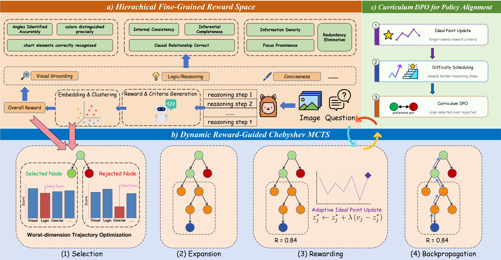

<div align="center">

# Improving Multimodal Reasoning via Worst Dimension Optimization

**MMS-PRM: A worst-dimension-aware process reward framework for reliable multimodal reasoning**

</div>

<p align="center">
  
</p>

## Introduction

Multimodal reasoning requires a model to maintain correctness across multiple constraints at the same time, including visual grounding, logical consistency, semantic correctness, and task-specific validity. In complex visual reasoning tasks, a single failure dimension can invalidate the entire reasoning trajectory, even when the remaining dimensions appear strong.

Existing process reward models often compress multiple reasoning-quality dimensions into a single scalar score. This scalarization can allow strong performance in one dimension to compensate for severe errors in another, such as visually hallucinated relations hidden behind fluent logical explanations.

To address this issue, we propose **MMS-PRM**, a multimodal process reward framework that optimizes reasoning trajectories with explicit attention to the **worst-performing reward dimension**. Instead of rewarding average quality, MMS-PRM encourages balanced, non-compensatory reasoning paths where every activated dimension must remain reliable.

## TODO

- [x] Method design
- [x] Main experiments
- [x] Ablation studies
- [ ] Code release
- [ ] Training scripts
- [ ] Evaluation scripts
- [ ] Model checkpoints

## Model and Training Setup

Our implementation is built on InternVL2.5-MPO as the base vision-language model.  
For supervised fine-tuning, we use the ShareGPT-Step-300K data from the CoS resources.

The overall training and alignment pipeline is:

1. Start from the base vision-language model.
2. Perform supervised fine-tuning on step-level reasoning data.
3. Construct hierarchical fine-grained reward dimensions.
4. Apply Chebyshev-guided MCTS to search for balanced reasoning trajectories.
5. Build preference pairs from searched trajectories.
6. Apply curriculum-style DPO for policy alignment.

Implementation details:

- **Base model**: InternVL2.5-MPO
- **Reward / criteria generation model**: Qwen2.5-VL-32B-Instruct
- **Embedding model**: BAAI/bge-en-icl
- **Clustering algorithm**: BIRCH hierarchical clustering
- **MCTS branch factor**: 3
- **Search depth**: 10
- **Reward fusion coefficient**: η = 0.5
- **Chebyshev augmentation coefficient**: ρ = 0.1
- **Ideal point update coefficient**: λ = 0.2

## Results

We evaluate MMS-PRM on six representative multimodal reasoning benchmarks, covering mathematical reasoning, chart reasoning, scientific diagram understanding, general visual reasoning, and multimodal chain-of-thought reasoning.

| Method | Size | MathVista | MMStar | MMMU | M3CoT | AI2D | ChartQA | Average |
| --- | ---: | ---: | ---: | ---: | ---: | ---: | ---: | ---: |
| InternVL2.5-MPO | 8B | 65.0 | 60.7 | 53.8 | 67.5 | 84.2 | 85.0 | 69.4 |
| InternVL2.5-MPO + SFT | 8B | 65.9 | 61.0 | 53.7 | 75.7 | 81.6 | 88.3 | 71.0 |
| **MMS-PRM** | 8B | **67.5** | **65.2** | **54.2** | **79.7** | **84.2** | **87.2** | **73.0** |

MMS-PRM improves the SFT baseline on most benchmarks and achieves the best average performance among the compared variants. The gains are especially clear on reasoning-intensive benchmarks such as M3CoT and MathVista, suggesting that worst-dimension-aware process supervision is particularly useful for long-horizon multimodal reasoning.

## Ablation Study

We conduct ablation studies on the M3CoT validation set to analyze the contribution of each component.

| Configuration | Accuracy (%) |
| --- | ---: |
| Baseline (SFT) | 67.4 |
| + Hierarchical reward | 70.1 |
| + Reward + Chebyshev MCTS | 73.6 |
| DPO only (w/o MCTS) | 71.2 |
| Weighted-sum MCTS | 75.3 |
| **MMS-PRM (full)** | **79.7** |

The full MMS-PRM framework achieves the best performance, showing that hierarchical rewards, Chebyshev-guided search, and curriculum-style DPO are complementary. Compared with weighted-sum MCTS, Chebyshev-guided MCTS better prevents weak-dimension collapse by explicitly emphasizing the lowest-performing reward dimension.

## Usage

The code release will include scripts for:

- Data preparation
- Supervised fine-tuning
- Fine-grained reward construction
- Chebyshev-guided MCTS trajectory search
- Preference pair construction
- Curriculum DPO training
- Benchmark evaluation

Example usage commands will be added after code cleanup.

```bash
# Coming soon
```

## Citation

If you find this work useful, please consider citing:

```bibtex
@misc{lv2025improving,
  title  = {Improving Multimodal Reasoning via Worst Dimension Optimization},
  author = {Lv, Haocheng and Zhang, Huaping and Li, Qiuchi and Li, Lei and Gao, Chunxiao},
  year   = {2025}
}
```

## Acknowledgements

We thank the open-source community for their contributions to multimodal reasoning, process reward modeling, tree search, and preference optimization. This work builds upon recent progress in vision-language models, fine-grained process supervision, Monte Carlo Tree Search, and Direct Preference Optimization.

## License

This project is released under the [Apache License 2.0](LICENSE).
